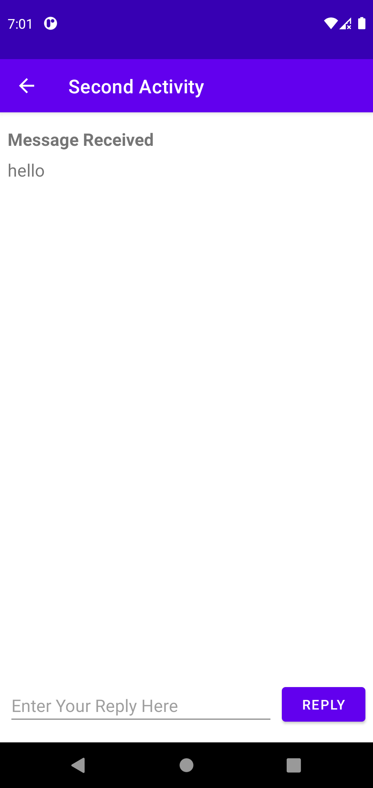
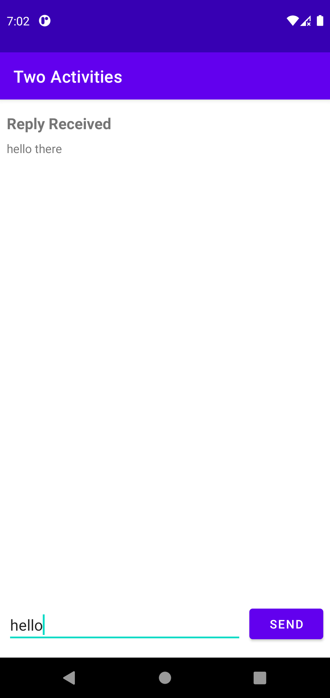
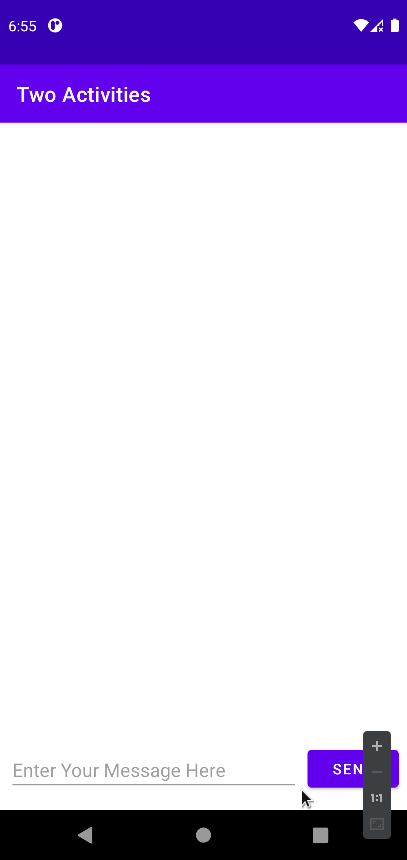

# Two Activities

## App Screen Shots

### Initial MainActivity

### Initial SecondActivity

### After message Sent from MainActivity to SecondActivity

### After message received from SecondActivity to MainActivity

### App running GIF

